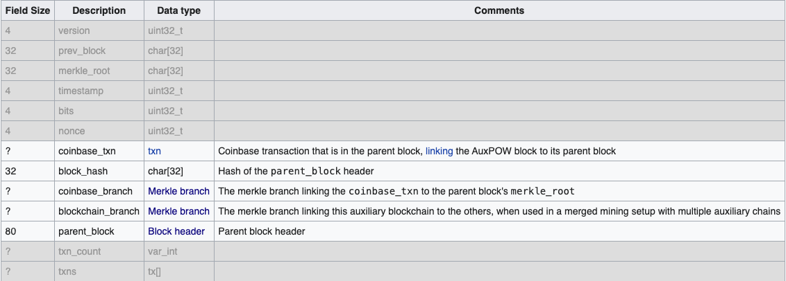

# crypto

Collection of explanations to better understand deeper crypto topics for applied research and development of distributed systems.

## Math Fundamentals

### Elliptic Curve Cryptography

Based on algebraic structure of elliptic curves over finite fields. Points on the field are denoted by `(x,y)` coordinates.

A group `G` is a set with single operations with the properties identity, associativity, invertibility, and closure.

A field `F` is a set with the two operations addition and multiplication, satisfying the field axioms. An example is `F_p = {0, 1, .., p-1}` which contains multiple groups and is a finite field of integegers modulo `p` (prime number).

Curve bilinear pairings operates on two cryptographic groups to obtain a third group. A map `t =  G_1 x G_2 -> G_T` has linear properties in first and second argument. Linearity is preserved in both arguments.

Curve pairings help solve more complex problems on the curve. If we have `P = p * G` and `Q = q * G` (where `p` and `q` are scalars, and `G` is a generator point on the curve), we can compute `R = p * q * G`, a point in `G_T`. If `R` and `G` is known for another party, it is computationally very unlikely to be able to retrieve `k = p * q`. See elliptic curve discrete logarithm problem (ECDLP).


### Commitment Scheme

A cryptographic protocol that allows one party to commit to a value without revealing it and the ability to do so later. Two fundamental properties: hiding and binding. Hiding ensures that the committed value remains confidential and cannot be inferred from the commitment itself. Binding ensures that once a value is committed, it is immutable (integrity).

#### Non-Interactive Schemes

The Pedersen commitment scheme is non-interactive. It is one-sided and does not require back-and-forth messaging between the commiter (sender) and verifier (receiver) such as the Diffie-Hellman key exchange algorithm. A way to make an interactive scheme (or proof) non-interactive is through Fiat-Shamir heuristic and creating a digital signature of it.

A Pedersen commitment consists of two steps:
1. Commit Phase: Alice chooses the desired value `v` and random value `r`. She computes the commitment `C = (g^v)*(h^r)` (where `g` and `h` are generators of a group `G`) and sends it to Bob.
2. Reveal Phase: Alice sends `v` and `r` to Bob and he computes the commitment `C'` to verify that it matches `C`.

From [1]:

A commitment scheme is a pair of algorithms `C(v,r) -> G` and  `Open(v,r,C) -> {true,false}` s.t. `Open(v,r,C(v,r))` accepts for all `(v,r)` in the domain of `G`. Satisfies the properties binding and hiding. A homomorphic commitment scheme allows commitments to `v` and `v'` to be added to obtain a commitment `v + v'` with the same security guarantees.

A Pedersen commitment maps `(v,r)` in the first algorithm above to `vH + rG` and the `Open` algorithms verifies the commitment as previously. This is a computationally binding and perfectly hiding homomorphic commitment scheme.

A range proof on a homomorphic encryption `C` is a proof that the committed value of `C` is within a given range `[a,b]`. Default range is `[0,2^n]` and cannot produce an overflow. It must be a zero-knowledge proof of knowledge of the opening information of the commitments.

#### Example: Why Use A Blinding Factor

From [2]:

A simple commitment scheme would be `hash(x)`. It would be computationally binding because if we commit to `x = 5`, we provide `hash(5) -> 68fde0b7` which is then revealed later by observing the same digest.

Problem? The scheme is not hiding since you can find the space of all numbers quite easily through a simple for loop `for x=0..MAX { hash(i) }`.

Slightly better way would be to add a factor `r` like `hash(x,r)`. Example: `r = b8bc7579`, `hash(5, r) = 4dd8fa60`, to reveal need to disclose both `5` and `r`. Note: need to specify the order of computation so it's not possible to claim that `5` was the blinding factor.

This is more useful but we need to be able to prove things about the commitments. This is why we need homomorphic commitments. We want to:
```
commit(x) -> a
commit(y) -> b

reveal(z) = x + y  // do not want to reveal x and y separately, ONLY the sum
verify(z, a + b) -> true
```

Let us set a point on the curve `X = x * G`, where `x` is a value, and the same with `Y = y * G`. This is binding because multiplying with the generator point is similar to the hash function, i.e. collision resistant.

Problem: same as above, we can use bruteforce to find the secret value so it won't help us.

Another attempt: let `X = `(5+r) * G`, reveal `5` and `r`. Not binding because you can find `r' = (5 + r) - 6  <-> r' + 6 = 5 + r`, so `X` is the same and you can reveal `6` and `r'`.

How about `hash(5, r) * G`? Then no longer homomorphic.

Solution: Pedersen commitments. Introduce `G`'s brother, `H`, another generator point distinct from `G`. Nobody can find `n` s.t. `n * G = H`.
```
X = r*G + v*H 
v: value committed
r: blinding factor
```

Not possible to come up with another `r` and `v` that results in `X`, unless knowing the ratio `G/H` (or `H/G`). Cannot know the factor to get between `G` and `H`.

Formula `X` above is hiding because you might guess that `v=5` and be correct but `13893429843*H` could also be in `X` so it's not feasible to attempt.

Also homomorphic:

```
X = r_1 * G + v_1 * H
Y = r_2 * G + v_2 * H
```

Want to prove `z = v_1 + v_2` without revealing individually. How?

Define point `Z = X + Y = (r_1 + r_2)*G + (v_1 + v_2)*H`. Reveal `r = r_1 + r_2` and `v = v_1 + v_2`, only reveal the sums. Then verifier can check `Z = r*G + v*H`.


### Applications in Protocols

From [3]:

In Monero (XMR), the input value spent and the value of the outputs sent are encrypted and opaque to everyone but the recipients of each output. Pedersen commitments allow you to send XMR without revealing the value of the transactions as well as verifying that they are valid and not creating new XMR.

Pedersen commitments mean that the sums can be verified as being equal but the XMR value of each of the sums and each individual XMR input & output value are undeterminable. In addition, the ratios of one input to another is undeterminable.

It is unclear which inputs are being spent as the ring signature lists both the real inputs being spent and decoy (dummy) inputs so you don't know which commitments need to be summed.

From [4]:

In Mimblewimble, and how it differs from Bitcoin. In the latter, you have a key associated with every input and a signature of the whole transaction with that key. Mimblewimble has a multi-signature across all inputs and all outputs. The sum of all the keys on the outputs minus the sum of all the keys on the inputs results in an elliptic curve point which can be treated as a public key. It represents a multi-signature public key for all the transacting parties (all the owners of every input and all the owners of every output).

## Consensus and Mining

### Merged Mining

Every hash calculated contributes to the total hash rate of the other merged mined chain(s).

Mining two or more chains at the same time, also known as Auxiliary PoW (AuxPoW), such that one chain can trust the other's work as their own and accept AuxPoW blocks [5]. Work done on the main chain (the parent) can also be used to check for validity (a solution) on the auxiliary chain (the child). Merged mining specifically targets Bitcoin like PoW systems (for example: Bitcoin-Namecoin, Monero-Tari).

A miner that is merge mining must continuously assemble blocks for both chains (including transaction sets). If the miner finds a solution for the parent chain (with higher difficulty than the child chain) it is valid for both and the block is broadcast on the parent chain. If the solution only satisfies the child chain, it is broadcast there. 

In the example of merge mining Bitcoin with Namecoin, if solving a BTC block, only an extra hash is required in the coinbase transaction's `ScriptSig` field. For the Namecoin block, it would need a reference to the Bitcoin block through its `AuxPow` data structure which contains comparatively more overhead compared to what is store in the Bitcoin ledger.

Example of an AuxPoW block on the Namecoin network where the shaded fields are there by default (when not merge mining) [5]:




## References

[1] A. Poelstra, _Mimblewimble_, 2016

[2] Confidential Transactions (MIT OpenCourseWare), https://www.youtube.com/watch?v=UySc4jxbqi4

[3] Moneropedia, https://www.getmonero.org/resources/moneropedia/pedersen-commitment.html

[4] MimbleWimble with Andrew Poelstra, https://www.youtube.com/watch?v=aHTRlbCaUyM

[5] Merged mining specification, https://en.bitcoin.it/wiki/Merged_mining_specification
